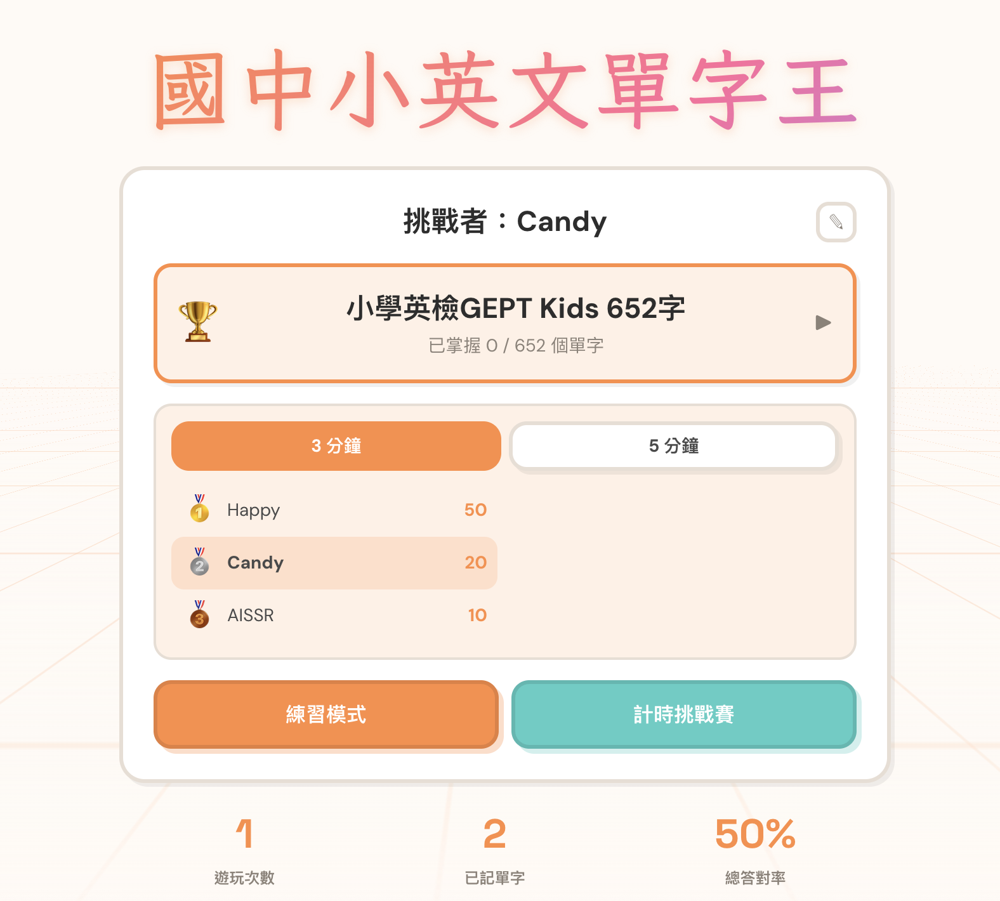
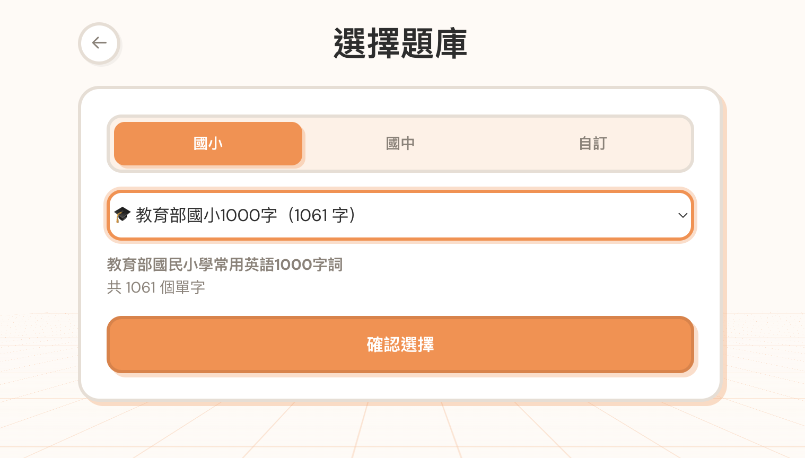
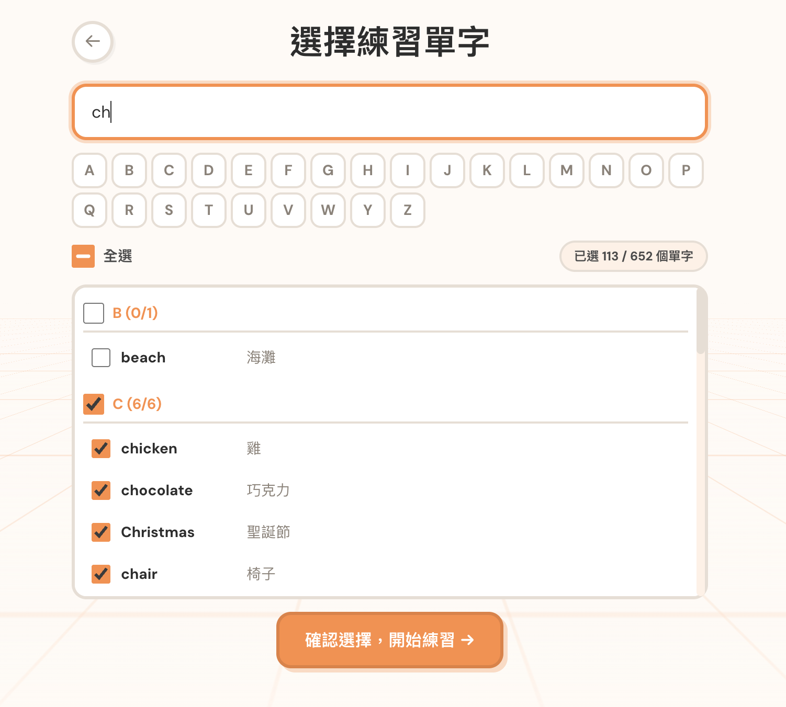
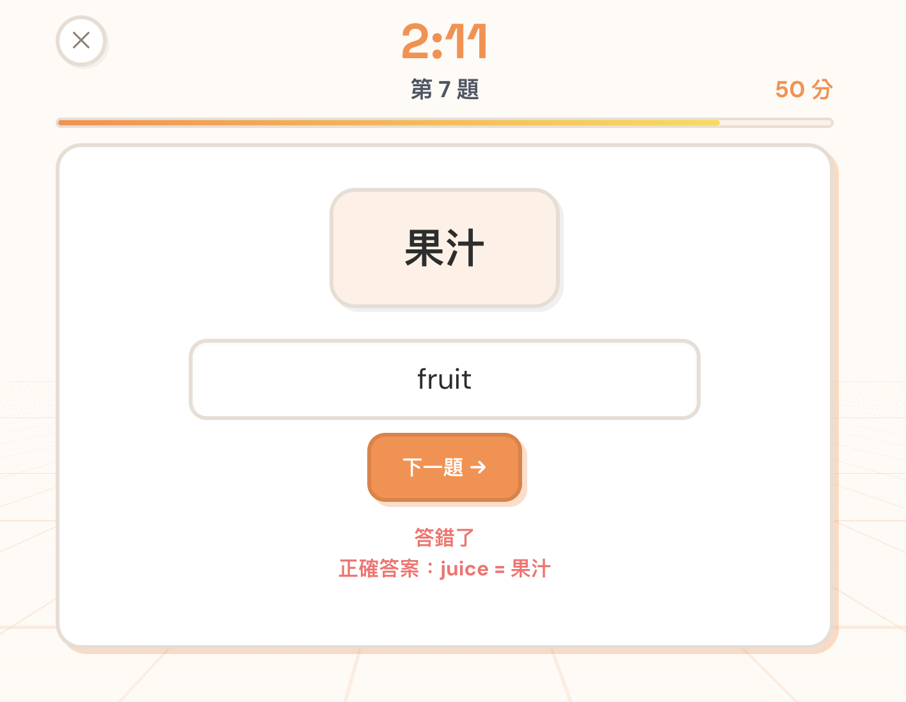

# 國中小英文單字王

國中小學生英語單字測驗遊戲，支援多套內建題庫與自訂 CSV 上傳。

**[線上試玩](https://0xaissr.github.io/junior-word-master/)**

## 截圖

| 首頁 | 題庫選擇 |
|:---:|:---:|
|  |  |

| 單字選擇 | 計時挑戰 |
|:---:|:---:|
|  |  |

## 功能

- **練習模式** — 選擇單字範圍，支援中翻英、英翻中、選擇題三種題型
- **計時挑戰賽** — 限時答題搶高分，本地排行榜記錄成績
- **多套內建題庫** — 小學英檢 GEPT Kids 652 字、宜蘭縣 400 字、國小必學 300 字、教育部國小 1000 字等共 7 套
- **自訂題庫** — 上傳 CSV 檔案（`英文,中文` 格式）建立自己的題庫
- **學習進度追蹤** — 記錄已掌握單字數量，查看已記單字列表

## 題庫來源

| 題庫 | 單字數 | 來源 |
|------|--------|------|
| 小學英檢 GEPT Kids | 652 | LTTC 小學英檢參考字表 |
| 台中市常用 300 字 | 300 | 台中市國小常用英文字彙表 |
| 花蓮縣初級 300 字 | 300 | 花蓮縣鑄強國小英語字彙王初級字表 |
| 花蓮縣中級 600 字 | 600 | 花蓮縣鑄強國小英語字彙王中級字表 |
| 宜蘭縣 400 字 | 400 | 宜蘭縣 114 學年度 English Easy Go 題庫 |
| 國小必學 300 字 | 300 | 克林頓美語教學團隊國小必學單字表 |
| 教育部國小 1000 字 | 1000 | 教育部國小英語單字表 |

## 技術

- Vanilla JS + HTML + CSS（無框架）
- Tailwind CSS（CDN）
- GitHub Pages 靜態部署
- localStorage 儲存進度與排行榜
